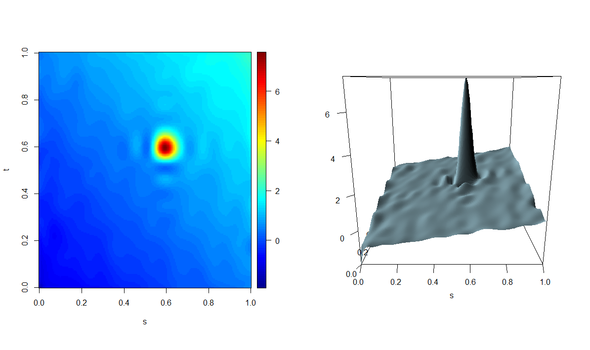

<!-- README.md is generated from README.Rmd. Please edit that file -->

# adass

<!-- badges: start -->

[](https://CRAN.R-project.org/package=adass)
[](https://github.com/unina-sfere/adass/actions/workflows/R-CMD-check.yaml)
<!-- badges: end -->

The package **adass** implements the adaptive smoothing spline (AdaSS)
estimator for the function-on-function linear regression model proposed
by Centofanti et al. (2023). The AdaSS estimator is obtained by the
optimization of an objective function with two spatially adaptive
penalties, based on initial estimates of the partial derivatives of the
regression coefficient function. This allows the proposed estimator to
adapt more easily to the true coefficient function over regions of large
curvature and not to be undersmoothed over the remaining part of the
domain. The package comprises two main functions `adass.fr` and
`adass.fr_eaass`. The former implements the AdaSS estimator for fixed
tuning parameters. The latter executes the evolutionary algorithm for
the adaptive smoothing spline estimator (EAASS) algorithm to select the
optimal tuning parameter combination as described in Centofanti et
al. (2023).

## Installation

You can install the released version of **adass** from
[CRAN](https://CRAN.R-project.org) with:

``` r
install.packages("adass")
```

The development version can be installed from
[GitHub](https://github.com/) with:

``` r
# install.packages("devtools")
devtools::install_github("unina-sfere/adass")
```

## Example

This is a basic example which shows you how to apply the two main
functions `adass.fr` and `adass.fr_eaass` on a synthetic dataset
generated as described in the simulation study of Centofanti et
al. (2023).

We start by loading and attaching the **adass** package.

``` r
library(adass)
```

Then, we generate the synthetic dataset and build the basis function
sets as follows.

``` r
case<-"Scenario HAT"
data<-simulate_data(case,n_obs=10)
X_fd <- data$X_fd
Y_fd <- data$Y_fd
basis_s <- fda::create.bspline.basis(c(0,1),nbasis = 30,norder = 4)
basis_t <- fda::create.bspline.basis(c(0,1),nbasis = 30,norder = 4)
```

Then, we calculate the initial estimate of the partial derivatives of
the coefficient function.

``` r
mod_smooth <-adass.fr(Y_fd,X_fd,basis_s = basis_s,basis_t = basis_t,tun_par=c(10^-6,10^-6,0,0,0,0))
grid_s<-seq(0,1,length.out = 10)
grid_t<-seq(0,1,length.out = 10)
beta_der_eval_s<-fda::eval.bifd(grid_s,grid_t,mod_smooth$Beta_hat_fd,sLfdobj = 2)
beta_der_eval_t<-fda::eval.bifd(grid_s,grid_t,mod_smooth$Beta_hat_fd,tLfdobj = 2) 
```

Then, we apply the EAASS algorithm through the `adass.fr_eaass` function
to identify the optimal combination of tuning parameters.

``` r
mod_adass_eaass<-adass.fr_eaass(Y_fd,X_fd,basis_s,basis_t,
                      beta_ders=beta_der_eval_s, beta_dert=beta_der_eval_t,
                      rand_search_par=list(c(-8,4),c(-8,4),c(0,0.1),c(0,4),c(0,0.1),c(0,4)),
                      grid_eval_ders=grid_s,grid_eval_dert=grid_t,
                      popul_size = 10,ncores=8,iter_num=5)
```

Finally, `adass.fr` is applied with tuning parameters fixed to their
optimal values.

``` r
mod_adass <-adass.fr(Y_fd, X_fd, basis_s = basis_s, basis_t = basis_t,
                   tun_par=mod_adass_eaass$tun_par_opt,beta_ders = beta_der_eval_s,
                   beta_dert = beta_der_eval_t,grid_eval_ders=grid_s,grid_eval_dert=grid_t )
```

The resulting estimator is plotted as follows.

``` r
plot(mod_adass)
```



# References

- Centofanti, F., Lepore, A., Menafoglio, A., Palumbo, B., Vantini, S.
  (2023). Adaptive Smoothing Spline Estimator for the
  Function-on-Function Linear Regression Model. *Computational
  Statistics 38(1), 191–216*.
